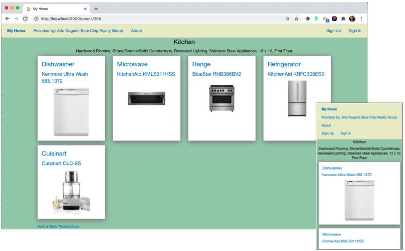

## My-Home

My-Home is a responsive application for people to keep track of how to use the equipment in their life. It’s a site to store and share manuals and operating videos and to find repair professionals. 

This application uses the Devise and CarrierWave gems as well as React Dropzone. It also uses AWS S3 Cloud Storage and ActiveRecord.

[See the deployed application on Heroku](https://my-home-222.herokuapp.com/)

# 

## Developer
- Jeff Korenstein

## Built with
- [Ruby on Rails](https://guides.rubyonrails.org/v5.2/)
- [React.js](https://reactjs.org/docs/getting-started.html)
- [PostgreSQL](https://www.postgresql.org/docs/13/index.html)
- [Foundation](https://get.foundation/)

## Run Locally
The setup steps expect the following tools/versions:
- Ruby 2.7.1
- Rails 5.2.3
- PostgreSQL 13

###### Clone the Repo
```
git clone 
```
###### Install Dependencies
```
yarn install 
bundle install 
```

###### Create and seed the database
```
bundle exec rake db: migrate
bundle exec rake db: seed
```

###### Run the test suite
```
bundle exec rspec
```
###### Start the Rails server and webpack-dev-server
```
bundle exec rails s
yarn run start
```

###### The application can be accessed locally at <http://localhost:3000>
